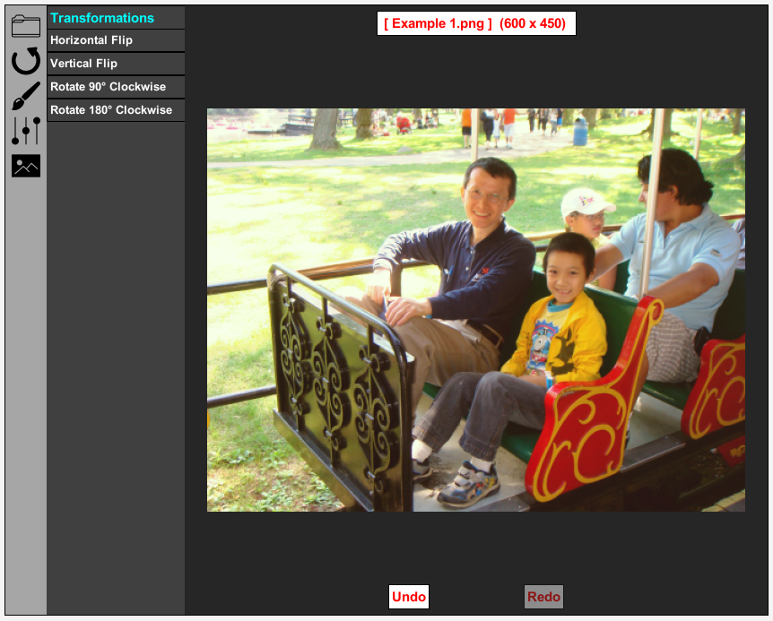

# PhotoEdit
Edit your photos with PhotoEdit! 

## Description
 Edit your photos with PhotoEdit! PhotoEdit allows users to open images and save them as png or jpg from any directory on the computer. It also allows users to perform a multitude of changes to their image in real-time, including rotations, flips, color filters, corrections including brightness, transparency, blurs, and contrast adjustions, and general effects like warm, cool, negative, and greyscale. There is also an undo and redo feature, allowing users to trace their edits. When the user hovers over a menu button, a pop-up hover appears, showing the name of that menu button.

## How to Run
1. Download [Greenfoot](https://www.greenfoot.org/download)
2. Click `Open in Greenfoot` [here](https://www.greenfoot.org/scenarios/25086).
3. Open *project.greenfoot*
4. Click *Run* to begin the simulation! 

### Credits
**Graphics:** Icons made by Smashicons and Freepik from www.flaticon.com